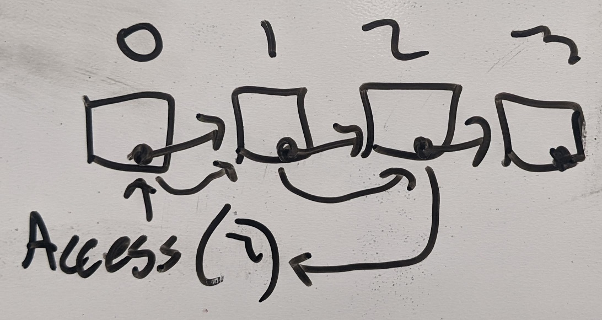
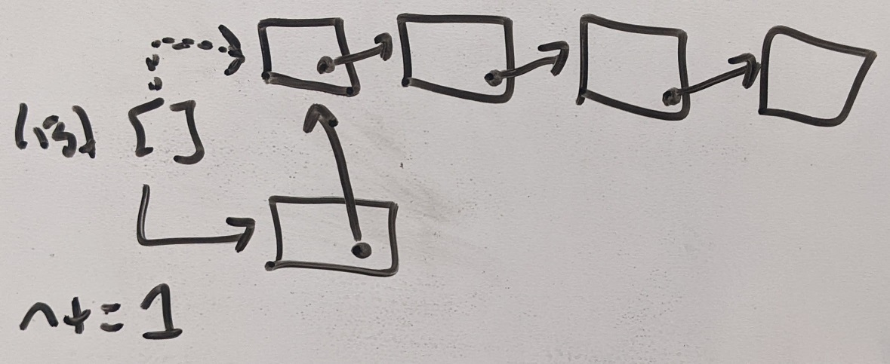

# Homework 1 - Any Size List with Pointers and Nodes / Recursion

```
2/c Joram Stith
COM 212 Data Structures
Dr. Parker
01FEB2022
```

## Problem 1a

```
Describe how to use a set of nodes with pointers (as described in class) to implement an unordered list with no size limit.
Determine how to do the following functions: access, length, concat, createEmptyList, isEmptyList, searchFor, remove,
inserti, and insert. How would any of these functions change if the list was to be ordered?
```
This additional information is provided about the definition of a list and functions for a list:

```
Lists

List L = x0  x1  x2  x3 ... xn-1     n =  # elements
If a list is ordered than the key of xi-1 <= the key of xi for all i where
0 < i < n.
The sort symbol <= can be replaced by >= or any other function that
determines ordering in the keys.
An unordered does not have this restriction.

Functions:
access(L, i)   		returns xi
length(L)  		returns n
concat(L1, L2)		returns a new list with L2 concatenated on to L1
createEmptyList()	returns a newly created empty list
isEmptyList(L)		returns true if L is empty and false if it is not
searchFor(L, key)	returns i where the key of xi = key
remove(L, i)		returns a list with xi removed
			the old xi+1 is now xi, etc.
inserti(L, i, x)	returns a list with x inserted as xi  
			the old xi is now xi+1, etc.
insert(L, x)		returns a list with x inserted anywhere
			if L is unordered at the proper location (say xi)
			if L is ordered the old xi is now xi+1, etc.
sort(L)			returns the list in sorted order
```

| Functions         | Definitions                                                                                                                            |
|:----------------- |:-------------------------------------------------------------------------------------------------------------------------------------- |
| access(L, i)      | returns xi                                                                                                                             |
| length(L)         | returns n                                                                                                                              |
| concat(L1, L2)    | returns a new list with L2 concatenated on to L1                                                                                       |
| createEmptyList() | returns a newly created empty list                                                                                                     |
| isEmptyList(L)    | returns true if L is empty and false if it is not                                                                                      |
| searchFor(L, key) | returns i where the key of xi = key                                                                                                    |
| remove(L, i)      | returns a list with xi removed the old xi+1 is now xi, etc.                                                                            |
| inserti(L, i, x)  | returns a list with x inserted as xi the old xi is now xi+1, etc.                                                                      |
| insert(L, x)      | returns a list with x inserted anywhere if L is unordered at the proper location (say xi) if L is ordered the old xi is now xi+1, etc. |
| sort(L)           | returns the list in sorted order                                                                                                       |

## Solution

### Declaration

To begin, we must initialize our first point that will be used in the list. To do this, set aside space in memory equal to `node size` and instantiate the list variable as a pointer to that memory. Additionally, instantiate a length variable n to `n = 0` (0 since the first node does not yet have a meaningful value) and a pointer (not yet assigned) to reference later nodes. As elements are added to the list, the pointer encapsulated in each node will point to the next node, whose pointer will point to the next node, etc.

### access(L, i)

_returns xi_

To access a certain element in the list, use the provided index variable to jump `i` pointers to find the node, then return the contents of the node at that location.



```python
def access(i):
	go to pointer 0
	for x in range(i):
		jump to next pointer
	return value at current pointer
```

#### Ordered vs Unordered

This function is unchanged if the list is ordered since the index doesn't care what's at that memory location, just where it is relative to the others.

### length(L)

_returns n_

Easiest function here to define! Simply return n, the variable holding the length of the list.

```python
def length():
	return n
```

#### Ordered vs Unordered

This function is unchanged since the length of the function is not dependent on order

### concat(L1, L2)

_returns a new list with L2 concatenated on to L1_

To concat two lists, simply play connect the pointers between the last element of the first list and the first element of the second list, and add the values of the length variable `n` together for both lists to get your new n.


#### Ordered vs Unordered

This function is unchanged if the list is ordered or not for the same reason that the length function is unchanged.

### createEmptyList()

_returns a newly created empty list_

This function does the same thing as the [declaration paragraph](#Declaration).

### isEmptyList(L):

To determine if the list is empty or not, you simply check the length variable `n` and see if it's equal to zero or not.

```python
def isEmptyList():
	return not n

or

def isEmptyList():
	if n == 0:
		return True
	return False
```

#### Ordered vs Unordered

This function is unchanged if the list is ordered or not for the same reason that the length function is unchanged.

### searchFor(L, key)

_returns i where the key of xi = key_

To search for the index of a certain value in the list, you must go through each value in the list (one pointer at a time), and see if the current node is equal to the provided `key`. While doing so, the function must increment a temporary index variable to see where in the list it is when it finds a match.

```python
def searchFor(key):
	go to pointer 0
	for i in range(n):
		if current node == key:
			return i
			jump to next pointer
```

#### Ordered vs Unordered

If the list is ordered, there are many other search algorithms that could be used. For example, you could use a binary search (discussed last class). However, because the process of accessing nodes is sequential and not direct (like it was with arrays), I'm not confident there's an algorithm with a better complexity than `O(n)` (in which case just use the search above).

### remove(L, i)

_returns a list with xi removed the old xi+1 is now xi, etc._

In order to remove a value at a certain location, the function must first get there by making `i` pointer hops (sounds like fun), then record the memory that node is pointing to and reassign the pointer of the previous node to the next one. After that, you don't actually have to delete the node from memory (although you'll want to eventually so why not now). Finally, decrement the size variable `n` by one.

```python
def remove(i):
	go to pointer 0
	for x in range(i):
		go to next pointer
	next_location = address of current pointer
	go back one pointer
	pointer address = next_location
	n -= 1
```

#### Ordered vs Unordered

List order doesn't matter if you're removing from a certain index (same reason as length and others). However, if you are removing the last value from the list, you can just decrement n by one because when you add a new value it'll take that second to last pointer and reassign it anyway.

### inserti(L, i, x)

_returns a list with x inserted as xi the old xi is now xi+1, etc._

To insert a new element into the list at a certain location, you follow basically the opposite of the remove function. Create a new node somewhere in memory, jump `x` pointers along the link of nodes, then reassign the value of the `x-1` node to the new node you created, then point the pointer with the node you just created to the current `x` node. Finally, increment the length variable `n` by one.

```python
def inserti(i, x):
	go to pointer 0
	for j in range(x):
		jump one pointer
	to_location = current pointer location
	location = create new node x (returns the memory address)
	pointer x = to_location
	pointer x-1 = location
	n += 1

# Horrible choice of variable names there I know
```

#### Ordered vs Unordered

This function is not impacted by list order, for the same reason length is not impacted.

### insert(x)

_returns a list with x inserted anywhere if L is unordered at the proper location (say xi) if L is ordered the old xi is now xi+1, etc._

### Unordered

While I am not exactly confident this is the most efficient, I'm guessing the best way to add an unordered node to the list is to put it at the front of the list, because accessing values is sequential and not direct. So, create your new node somewhere in memory, copy the current pointer the list variable holds and assign that to the new node's pointer, and change the list variable's pointer to the address if your new node. And, of course, increment the length variable `n`.



```python
# Unordered
def insert(x):
	create new node x
	pointer x = pointer of list variable
	pointer of list variable = location of x
	n += 1
```

### Ordered

To insert an element into the list in the correct location for an ordered element, we can use two functions we've already defined. First, use the `searchFor(x)` function passing the value of `x` that needs to be inserted to get the index to insert into. Second, use `inserti(i, x)` to put the new node in its appropriate location.

```python
def insert(x):
	location = SearchFor(x)
	inserti(x, location)
```

### Other Notes

For sorting algorithms, I believe it would be best to prioritize algorithms with the lowest number of accesses and higher numbers of comparisons, because accesses are more expensive with sequential access than direct access, while comparisons are the same cost.

### Hand-Written Notes


## Problem 1b

```
Write the recursive function:
fac(x) returns the x factorial

Write the recursive function:
exp(x,y) returns x to the y power
```

## Solution

### fac(x)

- The base case for the function will be when x = 0, because any number raised to the zero power is 1.
- All other cases will multiply the current value of x by the factorial of (x-1)

```python
def fac(x):
	if(x == 0):
		return 1
	return fac(x-1) * x
```

### exp(x,y)

- The base case for the function will be when y = 1, meaning there is only one more x to be multiplied into the final product.
- All other cases will multiply the current value of x by the exponent of x raised to the (y-1)

```python
def exp(x,y):
	if(y == 1):
		return x
	return exp(x, y-1) * x
```
