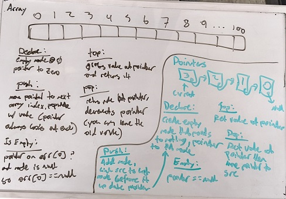

# Homework 2 - Stacks (Set Size Arrays and No Size Nodes)

```
2/c Joram Stith
COM 212 Data Structures
Dr. Parker
03FEB2022
```

## Problem 2a

```
Describe how to implement a stack using an array (assume it will never have more than 100 elements).
Do the five stack functions.
Describe how to implement a stack using an set of nodes with pointers (this stack will have no number of element limit).
Do the five stack functions.
Do not use the List abstract data type as part of your solutions.
```

This additional information is provided about the definition of a stack and functions for a stack:

```
Stacks

Stack S = x0  x1  x2  x3 ... xn-1     n =  # elements
A stack is like a list but the nodes are only accessed last-in-first-out
or LIFO.

Functions:
createEmptyStack()	returns a newly created empty stack
top(S)   		returns the last node of S
pop(S)  		returns and removes the last node of S
push(S, x)		returns a S with x added as the last element
isEmptyStack(S)		returns true if
```

| Functions | Definitions |
|:----------|:------------|
| createEmptyStack() | returns a newly created empty stack |
| top(s) | returns the last node of s |
| pop(s) | returns and removes the last node of S |
| push(s,x) | returns a S with x added as the last element |
| isEmptyStack(s) | returns true if stack is empty |

## Set Size Array with 100 Nodes

### Declaration

To declare an array based stack, begin by creating an array of nodes with length 101 (100 values plus a null condition at arr[0]). The value used to reference the stack will be a pointer that gets set to the zeroth index in the array (null by default). For a stack, we will only need one permanent pointer.

### createEmptyStack()

_returns a newly created empty stack_

Like the declaration paragraph, create your array of size 101 and data type node, set a pointer to the zeroth index. The zeroth index will forever by null, and will be used to indicate that the stack is currently empty.

```python
def createEmptyStack():
	create node[101]
	stack_pointer = location of node[0]
	return stack_pointer
```

### top(S)

_returns the last node of s_

To return the value of the top value in the stack, simply return the value currently being pointed to by the `stack_pointer` declared above. Since the stack pointer will move with every `pop` and `push` command, it will always point to the most recently added value (the one getting returned in a FIFO system).

```python
def top(S):
	return value pointed to by stack_pointer
```

### pop(S)

_returns and removes the last node of S_

Pop will be a very similar function to top, but the function will also dereference the memory at the top array value. For this, we actually don't have to delete the contents of the array, simply reduce the pointer's location by one array index. If the return value of top is NULL, meaning we are at the zeroth index of the array, don't worry about decrementing the pointer.

```python
def pop(s):
	value = top(s)
	if(value != NULL):
		stack_pointer = arr[current_location_of_pointer - 1]
	return value
```

### push(S, x)

_returns a S with x added as the last element_

To add a value to the stack with the push function, we do the opposite of the pop function. First, we advance the `stack_pointer` by one array index, then we populate that array index with the provided value (if there use to be memory there, it just gets overwritten).

```python
def push(S, x):
	stack_pointer = arr[current_location_of_pointer + 1]
	arr[current_location_of_pointer] = X
```

### isEmptyStack(S)

_returns true if stack is empty_

To determine if a stack is empty, you can check if the value of the `stack_pointer` is null. This is because if everything is taken off the stack, the pointer will be moved to the zeroth array index, which will always be null in this model.

```python
def isEmptyStack(s):
	return stack_pointer == null
```

### Other Notes

I had to work a little to reach the conclusion you could do this with only one pointer, but I was fairly confident it could be done. By adding one more index to the array, it lets you check for emptiness with O(1) and adds to the size of the array by O(1) (in this case literally 1).

## Variable Size with Pointers and Nodes

### Declaration

Stacks with pointers can be done in a similar fashion to arrays, changing the direct indexing of the `stack_pointer` to a sequential index of pointers within nodes.

### createEmptyStack()

_returns a newly created empty stack_

To create an empty stack, start by creating a "zeroth" element in the stack, whose value is NULL. This node (and all others) has a pointer that by default is set to nothing. Instantiate the `stack_pointer` to point to this node.

```python
def createEmptyStack():
	create node0 set to null
	stack_pointer = location of node0
	return stack_pointer
```

### top(S)

_returns the last node of s_

To return the top value of the stack, simply return the node currenty being pointed to with `stack_pointer`.

```python
def top(S):
	return stack_pointer
```

### pop(S)

_returns and removes the last node of S_

To return and remove the top value of the stack, use the top function to return the value at the current stack pointer, then change the `stack_pointer` to point to the node currently pointed to by the pointer of the node that just got returned.

```python
def pop(S):
	value = top(S)
	stack_pointer = stack_pointer.pointing_to
	return value
```

### push(S, x)

_returns a S with x added as the last element_

To add a value to the stack with the push function, link the pointer of the new node to the node currently pointed at by the `stack_pointer`, and also point `stack_pointer` to the new node.

```python
def push(S, x):
	x.pointing_to = stack_pointer
	stack_pointer = x
```

### isEmptyStack(S)

_returns true if stack is empty_

To determine if a stack is empty, you can check if the value of the `stack_pointer` is null. This is because if everything is taken off the stack, the pointer will be moved to the zeroth array index, which will always be null in this model.

```python
def isEmptyStack(s):
	return stack_pointer == null
```

### Other Notes

The stack with nodes appears to me to be basically identical to the list with nodes, except rather than link the next node with a pointer in the node you link the previous. The process of checking for an empty stack is the same as for a set size stack with arrays.

## Hand-Written Notes


