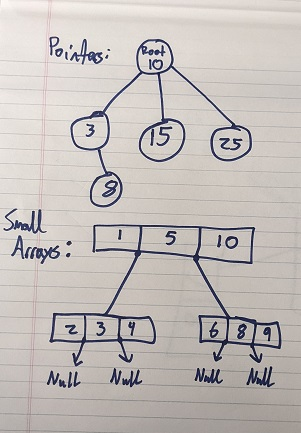
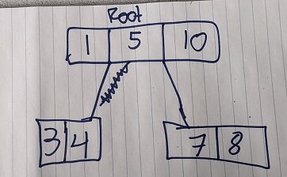
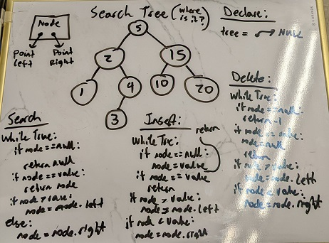

# Homework 5 - O(lg[n]) Search Tree

```
2/c Joram Stith
COM 212 Data Structures
Dr. Parker
15FEB2022
```

## Problem 5

```
Problem #5 due on 15 Feb.
Describe how to implement a search tree that has a worst time search, insert, and delete time of no more than O(lg n). This tree should have no number of element limit.
Do the six functions defined for binary search trees.
Discuss how you would implement this if there was a maximum to the number of elements.
```

This additional information is provided about the definition of a binary search tree and functions for a binary search tree:

```
Binary Search Tree

Tree T is a binary search tree made up of n elements: x0 x1 x2 x3 ... xn-1   

Functions:
createEmptyTree()  returns a newly created empty binary tree
delete(T, p)  	   removes the node pointed to by p from the tree T
insert(T, p)	   returns T with the node pointed to by p added in
                   the proper location
search(T, key)	   returns a pointer to the node in T that has a key
                   that matches key
 		   returns null if the node is not found
traverse(T)	   prints the contents of T in order
isEmptyTree(T)	   returns true if T is empty and false if it is not
```

| Functions | Definitions |
|:----------|:------------|
| createEmptyTree() | returns a newly created empty binary tree |
| delete(T, p) | removes the node pointed to by p from the tree T |
| insert(T, p) | returns T with the node pointed to by p added in the proper location |
| search(T, key) | returns a pointer to the node in T that has a key that matches key, returns null if the node is not found |
| traverse(T) | prints the contents of T in order. |
| isEmptyTree(T) | returns true if T is empty and false if it is not |

## Explanation of Reasoning

While I am not certain, I assume the difference between this homework and the last is that a regular search tree could have more than one child per parent. From my limited knowledge of data structures from a database management course, I know that there is such thing as an A,B search tree (I think that's what it's called?) that has an indexing time of O(lg[n]), and in which all children are equidistant from the root. But, I have no idea how to implement it. What follows is my best guess of how it's done.

### Using several small arrays

With sorted arrays, you can use a binary search to find an index in O(lg[n]) complexity. But, we can't make an array infinite size. So, what if we made a tree of smaller arrays? For each node in the tree (the node now being an array rather than a number), you could use a binary search on that small array to find the closest point from which to jump to a child. If you could then somehow link the child nodes to array indices of the parent node, you could jump to the next array, binary search there, and keep going until you find your index.



### Size of the arrays

Because arrays have to be declared to a set size, we would need to know how big to make each array. I think that would be based on the array size of the parent node? Or, it could be based on the total number of nodes (all children must be equidistant from the root), but that would make adding and removing complicated (no idea how to do that in O(lg[n]).

### Example

Search for the value of 8 in the following tree:



| Comparison | Current Node |
| :------------- | :------------- |
| 5 < 8; bin search right | [1,**5**,10] |
| 10 > 8; go to child of (5,10) | [1,5,**10**] |
| 7 < 8; bin search right | [**7**,8] |
| 8 == 8; return index | [7,**8**] |


## Solution

### createEmptyTree()

_returns a newly created empty search tree_

To create a new empty tree, create a pointer and point it to null. Return that pointer for future use.

```python
def createEmptyTree():
	pointer t = null
  return t
```

### search(T, key)

_returns a pointer to the node in T that has a key that matches key, returns null if the node is not found_

To search for a value, follow the methodology in the table above to go through the search tree using multiple binary searches of small arrays.

```python
def search(T, key):
  # Remember current_node now points to an array with encapsulated pointers
  current_node = T.root
  while True:
    if current_node == null:
      return -1
    if key in current_node:
      return T.indexOf(current_node)
    else:
      current_node = bin_search(current_node, key).nextNode
```

### delete(T, p)

_removes the node pointed to by p from the tree T_

Adding and deleting are tricky with this method, because the arrays are of set size. However, to delete and index you can simply find the value you are looking for and set that index in the array to null (hopefully that doesn't bork the binary search).

```python
def delete(T, p):
  current_node = search(T, p)
  if current_node == null or current_node == -1:
    return current_node
  else:
    current_node = null
    return 1
```

### insert(T, p)

_returns T with the node pointed to by p added in the proper location_

To insert a value, we follow the same procedure as deleting to find the appropriate location, but instead of setting the value to null we either add to the array (if available) or create a new child array. I'm not confident this method fits O(lg[n]), but it's the best I can come up with without using the internet.

```python
def insert(T, p):
  # Remember current_node now points to an array with encapsulated pointers
  current_node = T.root
  while True:
    if current_node == null:
      return -1
    else:
      while True:
        if p in current_node:
          return -1
        index = bin_search(current_node, p)
        # Aggressively psuedocoding this
        if("space in array"):
          current_node.insert(p)
        else: # No space in array
          index.nextNode = new array
          new array.insert(p)
          "modify other arrays for consistent length" # <-- there's the kicker
          return 1
```       

### traverse(T)

_prints the contents of T in order._

To print all of the contents of T in order, we recursively go through all arrays and sub-arrays and print their values. This is very similar to the binary tree, just that we must also go through array indexes for individual nodes rather than print a single value. By iterating through the full array, we don't need to worry about calling left and right side of the tree, since they'll all get called at some point in the array.

```python
def printNode(T, p):
  if(not T == null):
    for x in range(len(T)):
      print(x)
      if(x == 0 and node_exists("base", x)):
        printNode(T.nextNode("base", x))
      elif(x <= len(T)-2 and node_exists(x, x+1)):
        printNode(T.nextNode(x,x+1))
      elif(x = len(T)-1 and node_exists(x,"end")):
        printNode(T.nextNode(x,"end"))
  return

def traverse(T):
  current_node = T.root
  if(current_node == null):
    return null
  printNode(T, current_node)
  return
```

### isEmptyTree(T)

_returns true if queue is empty_

To determine if a queue is empty, simple check if the passed value of T is pointing to null.

```python
def isEmptyTree(T):
	return T == null
```

### Hand Written Nodes (wrong, but still work to show)


