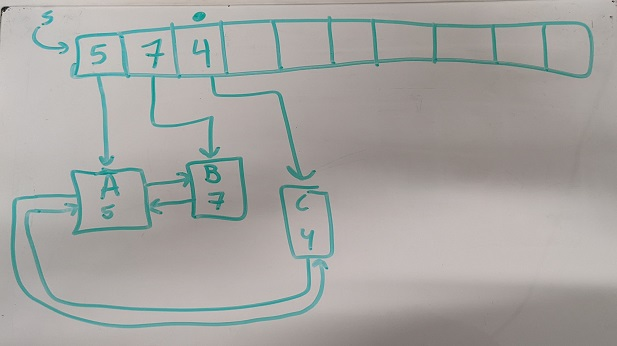

# Homework 6 - Priority Queues

```
2/c Joram Stith
COM 212 Data Structures
Dr. Parker
17FEB2022
```

## Problem 6

```
Problem #6 due on 17 Feb.
Describe how to implement a priority queue that has a worst case findMin of O(1) and an insert and delete time of no more than O(lg n). Do not use an AVL tree. You can assume that n is always less than 128. In other words, there is a max of 127 elements that can be stored in the queue.
Do the five Priority Queue functions.
```

This additional information is provided about the definition of a priority queue and functions for a priority queue:

```
Priority Queues

A Priority Queue Set S = x0  x1  x2  x3 ... xn-1     n =  # elements
A priority queue is like a list but the nodes are only accessed in
some specific order.

Functions:
createEmptySet()	returns a newly created empty priority queue
findMin(S)   		returns the minimum node with respect to ordering
deleteMin(S)  		returns S with the minimum node removed
insert(S, x)		returns S with x added  
isEmptySet(S)		returns true if S is empty and false if it is not
```

| Functions | Definitions |
|:----------|:------------|
| createEmptySet() | returns a newly created empty priority queue |
| findMin(S) | returns the minimum node with respect to ordering |
| deleteMin(S) | returns S with the minimum node removed |
| insert(S, x) | returns S with x added |
| isEmptySet(S) | returns true if S is empty and false if it is not |

## Methodology

### Wrong Ideas

#### Binary Tree with pointer to low value

| Pros | Cons |
| :------------- | :------------- |
| Could always find smallest item | Tree needed to be balanced for lg[n] insertion |


#### Unordered Array sorted by Binary tree

| Pros | Cons |
| :------------- | :------------- |
| Use binary tree to find weights | Was still O(n) to link that back to the unordered list |


#### Traditional Queue referencing linked list

| Pros | Cons |
| :------------- | :------------- |
| Could track regular queue stuff in O(1) | Finding next smallest item in linked list was still O(n) |
| Looked really cool on paper | Not actually any different than linked lists |


#### Unordered List with Pointer to Linked List

Really didn't work, but it seemed like a good idea at the time...



## Solution

### Best Idea I've Got

After toying with *several* incorrect solutions that all painfully turned out to be creative but ultimately useless version of O(n) sorted lists (see images below), I came across a model that *might* work. Did I crack the code a priority queue? Can I simply not confirm this one is wrong because I don't intuitively understand lg[n] complexity in binary trees? I guess I'll find out on Thursday!

My best guess is to use a kind of binary tree where the data isn't really sorted as it's entered. Rather, it's location on the tree is partly determined by it's relative value, and partly by when it gets entered. For example, the first element entered will get the top spot regardless of it's value. After that, the next two values will go below the root node with the lesser value on the left and the greater value on the right. The next two nodes will also be sorted by value, but will both go under the left child node regardless. This pattern continues, with nodes filling in the first empty space when another is removed.

I am by no means confident this is correct. I think I'm beating around the bush of what must be done to keep the O(lg[n]) for insertion and deletion, and hopefully all the failed attempts will help the correct one make sense.

### createEmptySet()

_returns a newly created empty priority queue_

To create a new empty priority queue, create a pointer and point it to null. Return that pointer for future use. Also, create an index to keep track of how many elements have been added.

```python
def createEmptySet():
	pointer t = null
  n = 0
  return t
```

### findMin(S)

_returns the minimum node with respect to ordering_

To find the value with the smallest (highest) priority, you need to traverse the tree going leftward on the two branches because the smaller value will always be left of the bigger one.

```python
def findMin(S):
  current_node = S.root
  if current_node == null:
    return -1
  smallest = current_node.value
  while True:
    current_node = current_node.left
    if current_node == null:
      current_node = S.root
      break
    else:
      if current_node.value < smallest:
        smallest = current_node.value
  while True:
    current_node = current_node.right
    if current_node == null:
      break
    else:
      if current_node.value < smallest:
        smallest = current_node.value
  return smallest
```

### deleteMin(S)

_returns S with the minimum node removed_

To delete the minimum node, you first must find it. Use the findMin() function for that. Then, you can adjust the tree based on how many children the node has using single left and right rotations like we talked about in class.

```python
def deleteMin(S):
  current_node = findMin(S)
  if current_node == null or current_node == -1:
    return -1
  else:
    switch "number of child nodes"
      case 0: "remove"
      case 1: "point parent to child and remove"
      case 2: "do a single left or right rotation"
      return 1
```

### insert(S, x)

_returns S with x added_

To insert a value, we simply keep track of how many values have been added and slot our value in at the next chronological one (like an unordered list). Also, we add to our index variable to see where to put the new value.

```python
def insert(S, x):
  n += 1
  current_node = T.root
  if current_node == null:
    return -1
  else:
    if n == [1,2,5,6,11,12,13,14,...]:
      "insert to the right side of the tree" <-- #same math just down a power of two for each branch to find specific location
    else:
      "insert to the left side of the tree" <-- #same math just down a power of two for each branch to find specific location
```

### isEmptySet(S)

_returns true if S is empty and false if it is not_

To determine if a queue is empty, simple check if the passed value of T is pointing to null.

```python
def isEmptyTree(T):
	return T == null
```
