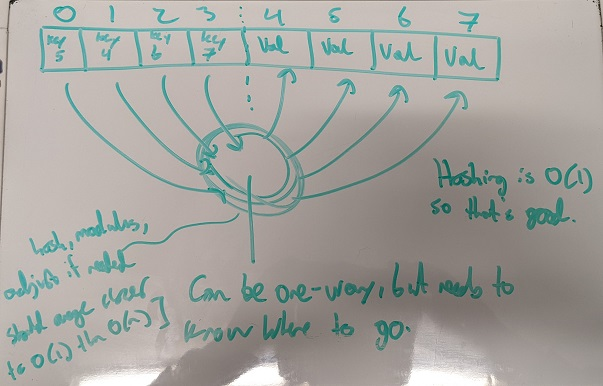

# Homework 7 - Dictionaries

```
2/c Joram Stith
COM 212 Data Structures
Dr. Parker
22FEB2022
```

## Problem 7

```
Problem #7 due on 22 Feb.
Describe how to implement a dictionary that has an average lookUp, insert, and delete time of O(1), but uses an array of no more than 2 times the maximum number of elements that will be stored in the dictionary.
Do the five Dictionary functions.
What is the worst case time for lookUp?
```

This additional information is provided about the definition of a dictionary and functions for a dictionary:

```
Dictionaries

A Dictionary is a set S mde up of n elements: x0  x1  x2  x3 ... xn-1  that
has the following functions.

Functions:
createEmptySet()	returns a newly created empty set
lookUp(S, k)   		returns the node in S that has the key k
insert(S, x)		returns S with x added  
delete(S, k)  		returns S with x (found using x.k) removed
isEmptySet(S)		returns true if S is empty and false if it is not
```

| Functions | Definitions |
|:----------|:------------|
| createEmptySet() | returns a newly created empty set |
| lookUp(S, k) | returns the node in S that has the key k |
| insert(S, x) | returns S with x added |
| delete(S, k) | returns S with x (found using x.k) removed |
| isEmptySet(S) | returns true if S is empty and false if it is not |

## Methodology

I admit to having some prior knowledge with dictionaries - I use them all the time for log file analysis and parsing in cyber security competitions. However, beyond the key-value relationship and the use of hash functions, I don't know any specifics. So, I made up a basic and completely arbitrary hashing algorithm for values going into the dictionary. Assuming one uses a sufficiently high entropy hash, the more values in the dictionary the close to O(1) from O(n) the complexity of adding values will get (the more slots to store data, the less likely one has been used).

## Solution

### createEmptySet()

_returns a newly created empty set_

To create a new empty dictionary, instantiate an array of size 2n for n elements possible in the dictionary, as well as an index variable for how many elements are currently in use.

```python
def createEmptySet(size):
	arr = new array(size)
	n = 0
```

### lookUp(S, k)

_returns the node in S that has the key k_

To get a value from a key, we go to the value of key in the array and check which value later in the array that points to. Jump to that value in the array and return the value.

```python
def lookUp(S, k):
  return S[k].pointsTo()
```

### insert(S, x)

_returns S with x added_

To insert a value, we need to first find a key, then use our hashing algorithm to give that value a spot in the array and save that location with the key. If the spot the hash gives is already in use (likely for dicts with almost as many entries as spots) keep adding until you get an open one (won't always be O(1) but is closer than O(n)).

```python
def insert(S,x):
  # Not sure how this is done without passing a key, we'll just use the first key for an example
	key = S[0]
	index = hash(key) % (size / 2) + (size / 2)
	# This will come closer and closer to O(1) as the dict gets larger
	for x in range(size / 2, size):
		if not S[x].isEmpty():
			index += 1
	S[index] = x
	key.index = index
	return S
```

### delete(S, k)

_returns S with x (found using x.k) removed_

To delete a value, we first go to the key and find what spot the key is referencing, and delete it. Then, remove the index variable from the key.

```python
def delete(S, k):
	key = S[k]
	# Remove value
	S[key.index] = null
	key.index = 0
	return S
```

### isEmptySet(S)

_returns true if S is empty and false if it is not_

To determine if the set is empty, we can check if there are any keys in the dictionary or not.

```python
def isEmptySet(S):
	for x in range(0, len(S) / 2):
		if not S[x] == null:
			return False
	return True
```

### Other Thoughts

I'm not sure how to go about accessing they keys themselves in O(1), or how we add values without adding a key with that value. However, I think the methodology of using a one way function to find where to store values for a key is the right way to go, since I know from practice that you can't find a key from a value, only a value from a key, and it wouldn't make sense to impose that limitation for no reason.

### Hand Written Notes


