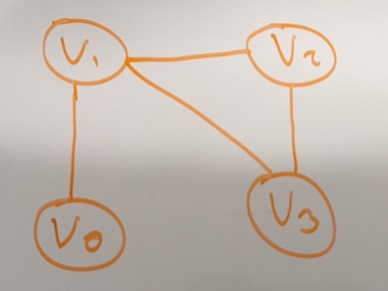
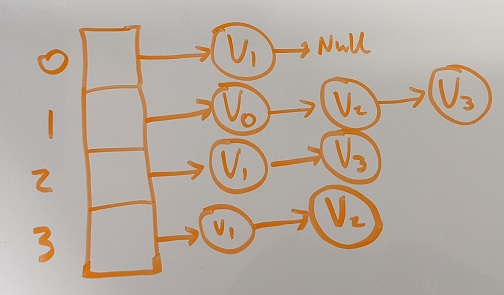
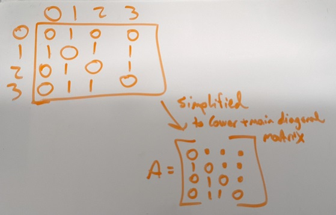

# Homework 8 - Graphs

```
2/c Joram Stith
COM 212 Data Structures
Dr. Parker
24FEB2022
```

## Problem 8

```
Give a one sentence explanation of how you would perform each of these procedures on a graph using both methods of representing a graph as described in class.
In addition, what is the runtime (big O) for each procedure for each method of representing?
incidentEdges(v) -- returns the set of edges touching vertex v
  adjacency list:
  adjacency matrix:
areAdjacent(v u) -- tests if vertices v and u are adjacent -- returns T or F
  adjacency list:
  adjacency matrix:
neighbors(v) -- returns the set of nodes adjacent to v
  adjacency list:
  adjacency matrix:
insertEdge(v u) -- inserts an edge between vertices v and u
  adjacency list:
  adjacency matrix:
removeEdge(v u) -- removes the edge between v and u
  adjacency list:
  adjacency matrix:
```

## About Graphs



- Graphs are a new data structure that is used to categorize connections between data. There are also directions and weights that can be applied to connections.
- The data points in graphs can be called `vertices` or `nodes`.
- The connections between data points in graphs are called `edges`.
- The number of nodes adjacent (connected directly) to another node is that node's `degree`
- We discussed two methods of storing graph data in lecture on Tuesday. They are an `adjacency list` and an `adjacency matrix`.

### Adjacency List



- An adjacency list stores the nodes of a graph in an array, and those array values also hold linked lists with all of the nodes adjacent to that particular node (you can deduce the vertices from there).
- At a high level, an adjacency list holds data about nodes and you have to figure out the vertices.

### Adjacency Matrix



- An adjacency matrix stores zeros or ones for each combination of two nodes, indicating if a vertex connects the two or not.
- At a high level, a adjacency matrix stores information about the vertices and you have to figure out node placement from there.
- To reduce storage, the information can be stored in a diagonal matrix, but I'll use the full size one for simplicity.

## Solution

### incidentEdges(v)

_returns the set of edges touching vertex v_

#### Adjacency List

To get a list of incident edges to a vertex v, navigate to v's index in the array (can simply be arr[v] if your nodes are stored numerically) and return the generated list of all nodes in the linked list attached to that vertex. The complexity of this operation is `O(degree(B))`.

#### Adjacency Matrix

To get a list of incident edges to a vertex v, find the row that corresponds to the vertex v (i.e. V0 is the 0th row, V1 is the 1st, etc.) and return all edges indicated by 1s in the column. The complexity of this operation is `O(n)`.

### areAdjacent(v u)

_tests if vertices v and u are adjacent -- returns T or F_

#### Adjacency List

To test if two nodes are adjacent, you'll go to the first passed node's index in the array, and check if the second node is contained in the linked list stored at that index. The complexity of this operation is `O(degree(B))`, because the average number of nodes that have to get checked will be `degree(B) / 2` (just like an unsorted list).

#### Adjacency Matrix

To test if two nodes are adjacent, you'll go to the first passed node's row in the matrix, then check to see if the intersection of the first node's row and the second row's column is set to 1. The complexity of this operation is `O(1)` because we know exactly where to look to see if these nodes are connected or not.

### neighbors(v)

_returns the set of nodes adjacent to v_

#### Adjacency List

To find all nodes adjacent to a passed node, simply return the linked list attached to the index of the passed node v. The complexity of this operation is `O(1)` because we know exactly where to look for the list.

#### Adjacency Matrix

To find all nodes adjacent to a passed node, go to the row of the passed node v and return a list of all column numbers that have a 1 in that row. The complexity of this operation is `O(n)` because you have to check every node (except the one in use) to check for neighbors.

### insertEdge(v u)

_inserts an edge between vertices v and u_

#### Adjacency List

To add an edge between two nodes, you must go to each node's index in the array and add the other node to the linked list at that index. The complexity of this operation is `O(1)`, because while you need to update two lists, you will always have to change only two lists regardless of how many nodes there are. Also, you don't need to worry about where the second node gets inserted into the first node's linked list, so adding that node can by O(1) too.

#### Adjacency Matrix

To add an edge between two nodes, you must go to the interception of the first node's row and the second node's column and set the value to one. Repeat with the first node's column and the second node's row if you're using the full size vector. This operation is also `O(1)` for the same reason as with adjacency lists, always changing exactly two things that we know exactly where to get to.

### removeEdge(v u)

_removes the edge between v and u_

#### Adjacency List

To remove an edge between two nodes, you must go to each node's index in the array and remove the other node from the linked list at that index. The complexity of this operation is `O(degree(B))`, because while you only need to update two lists, the location of the other node in each linked list is not known, meaning the average search time to find each one will be `degree(B) / 2`.

#### Adjacency Matrix

To remove an edge between two nodes, you must go to the interception of the first node's row and the second node's column and set the value to zero. Repeat with the first node's column and the second node's row if you're using the full size vector. This operation is `O(1)` for the same reason as with insert edge, you are always changing exactly two things that we know exactly how to get to.
