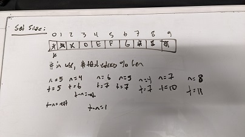
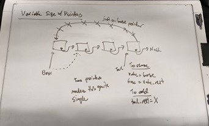
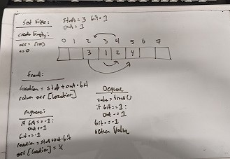
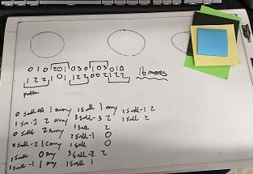
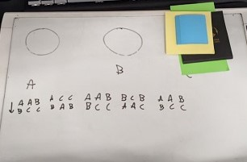

# Homework 4 - Binary Search Tree

```
2/c Joram Stith
COM 212 Data Structures
Dr. Parker
10FEB2022
```

## Problem 4a

```
Problem #4a due on 10 Feb.
Describe how to implement a binary search tree using a set of nodes (this tree will have no number of element limit).
Do the six BST functions.
Can you determine how to implement a binary search tree using an array (assume it will never have a depth of more than 7)?
Consider the six BST functions.
```

This additional information is provided about the definition of a binary search tree and functions for a binary search tree:

```
Binary Search Tree

Tree T is a binary search tree made up of n elements: x0 x1 x2 x3 ... xn-1   

Functions:
createEmptyTree()  returns a newly created empty binary tree
delete(T, p)  	   removes the node pointed to by p from the tree T
insert(T, p)	   returns T with the node pointed to by p added in
                   the proper location
search(T, key)	   returns a pointer to the node in T that has a key
                   that matches key
 		   returns null if the node is not found
traverse(T)	   prints the contents of T in order
isEmptyTree(T)	   returns true if T is empty and false if it is not

```

| Functions | Definitions |
|:----------|:------------|
| createEmptyTree() | returns a newly created empty binary tree |
| delete(T, p) | removes the node pointed to by p from the tree T |
| insert(T, p) | returns T with the node pointed to by p added in the proper location |
| search(T, key) | returns a pointer to the node in T that has a key that matches key, returns null if the node is not found |
| traverse(T) | prints the contents of T in order. |
| isEmptyTree(s) | returns true if T is empty and false if it is not |

## Variable Size with Pointers and Nodes

### Declaration

To declare an array based queue, begin by creating an array of nodes with length 100, as well as two variables. I'm not sure this is correct, but I love the idea so we're going with it. The two variables will be `number = n` and `total = t`.

### createEmptyQueue()

_returns a newly created empty queue_

Like the declaration paragraph, create your array of size 100 and set the variables `n = 0` and `t = 0`. `n` will refer to the number of array slots currently in use holding values and `t` will refer to the total number of entries that have been used at some point. These numbers will both get large over time, but they can both be put `% len(arr)` safely, as long as they get decremented together.

```python
def createEmptyQueue():
	create node[100]
	n = 0
	t = 0
```

### front(Q)

_returns the first node of Q_

To return the first entered value, we find the current index in the array being used by subtracting n from t

```python
def front(Q):
	return arr[t-n]
```

### dequeue(Q)

_returns and removes the first node of Q_

To dequeue a value, use the front(Q) function to find and store the value getting returned, then decrement `n` by one to indicate that there is one less array slot currently holding a relevant value. `t` remains unchanged.

```python
def dequeue(Q):
	value = front(Q)
	if(value != NULL):
		n -= 1
	return value
```

### enqueue(Q,x)

_returns Q with x added as the last element_

To add an element to a queue, we add the element to the current value of `t`, the total number of entries so far. Then, we increment both `t` and `n`, and reduce both by 100 if they are both larger than 100.

```python
def enqueue(Q, x):
	arr[t] = x
	t += 1
	n += 1
	if(t > 100 and n > 100):
		t -= 100
		n -= 100
```

### isEmptyQueue(Q)

_returns true if queue is empty_

To determine if a queue is empty, simple check if `n` is equal to zero.

```python
def isEmptyQueue(s):
	return n == 0
```

### Other Notes

I had an intricate plan at first to solve this using three variables: the center of the array, a certain distance away, and a bit flipped to indicate direction. After writing everything out on the wipe board, I realized that all I had created was another way to do stacks. So, back to the drawing board (literally) to get this iteration.

## Variable Size with Pointers and Nodes

### Declaration

To declare a pointer based queue, you'll start by creating an empty node with a pointer that will eventually point to the next node, but for now it points to null. We will also use two reference pointers, head and tail.

### createEmptyQueue()

_returns a newly created empty queue_

Like the declaration paragraph, start by creating an empty node with a pointer pointing to null. Next, create two other pointers, `head` and `tail` that both point to that empty node.

```python
def createEmptyQueue():
	create empty node
	node.next = null
	head = node
	tail = node
```

### front(Q)

_returns the first node of Q_

To return the first node of Q, simple return the value currently pointed to by the tail pointer.

```python
def front(Q):
	return tail
```

### dequeue(Q)

_returns and removes the first node of Q_

To dequeue a value, use the front(Q) method to get the value that needs to be returned. To "remove" the element from the queue, change the `tail` pointer to the node pointed to by `tail`'s current location.

```python
def dequeue(Q):
	value = front(Q)
	if(value != NULL):
		tail = tail.next
	return value
```

### enqueue(Q,x)

_returns Q with x added as the last element_

To add an element to a queue, access the furthest node along in the chain using the head pointer, then set `head.next` to the new node being added (whose pointer will point to null). Then, update the head pointer to `head.next` to reference the new newest node.

```python
def enqueue(Q, x):
	head.next = X
	head = head.next
```

### isEmptyQueue(Q)

_returns true if queue is empty_

To determine if a queue is empty, simple check if the tail pointer is pointing to null (the head pointer will actually never point to null because it doesn't get changed when a value is removed, but the tail does).

```python
def isEmptyQueue(s):
	return tail == null
```

### Other Notes

Queues seem a lot easier to handle with an O(1) notation if you use two pointers. Conceptually, it's much simpler than using arrays where I had to play with subtraction and essentially modulus to get a working system.

## Hand-Written Notes







## Problem 3b

```
Write the recursive function:
towers(x,y,n) moves n disks from peg x to peg y. You can use the predefined functions move(x,y), which moves one disk from peg x to peg y, and otherPeg(x,y), which returns the other peg besides x and y. So a call to otherPeg(A,B) would return C.
```

### Hard Coded

```python
def towers(A,C,3):
	move(A,B)
	move(A,C)
	move(B,C)

	move(A,B)
	move(C,A)
	move(C,B)

	move(A,B)
	move(A,C)
	move(B,C)

	move(A,B)
	move(A,C)
	move(B,C)
```

### Patterns

I look at these patterns like rhyme schemes, splitting the towers by where they start and where they're going. The start follow this pattern:

```
Pegs:   AAB, ACC, AAB, BCB, AAB
Tiles:  010, 201, 030, 103, 010
```

while the ends follow this pattern:

```
Pegs:   BCC, BAA, BCC, AAC, BCC
Tiles:  122, 101, 122, 002, 122
```

Unfortunately, neither of these follow an obvious pattern to turn into recursion. I struggled with this problem for a while, and unfortunately I didn't come to a great solution that works universally.

```python
def towers(A,B,2):
	move(A, otherPeg(A,B))
	move(A, B)
	move(otherPeg(A,B), B)

def towers(A,B,3):
	move(A, B)
	move(A, otherPeg(A,B))
	move(B, otherPeg(A,B))

	move(A,B)
	move(otherPeg(A,B), A)
	move(otherPeg(A,B), B)
	move(A,B)
```

The process is pretty much the same for two and three pegs except you change where the first one goes if the number to move is even or odd. Unfortunately, not sure how to put that into a recursive function.

The number of steps needed for small numbers seem to be `2 ^ (num things moved) - 1` for three pegs, which I also don't see playing nicely into recursion.

```python
def towers(A,C,3):
	move(A,C)
	move(A,B)
	move(B,C)

	move(A,C)
	move(B,A)
	move(B,C)
	move(A,C)
```

After banging my head against this one for a while, time expires and I don't have a great solution. However, if it did work mine would look something like this:

```python
def towers(A,B,x):
	if x == 1:
		move(A, otherPeg(A,B))
		move(A, B)
		move(otherPeg(A,B), B)
		return
	elif (x // 2 != 0):
		move(A, B)
		move(A, otherPeg(A,B))
		move(B, otherPeg(A,B))
	return towers(A,B,x-1)
```

### Other Notes

I'll be very interested to see the solution to this one. I remember studying these in discrete mathematics and the difficulty of solving them increasing exponentially, so I'm curious to see how that works with code.

### Hand-Written Notes




